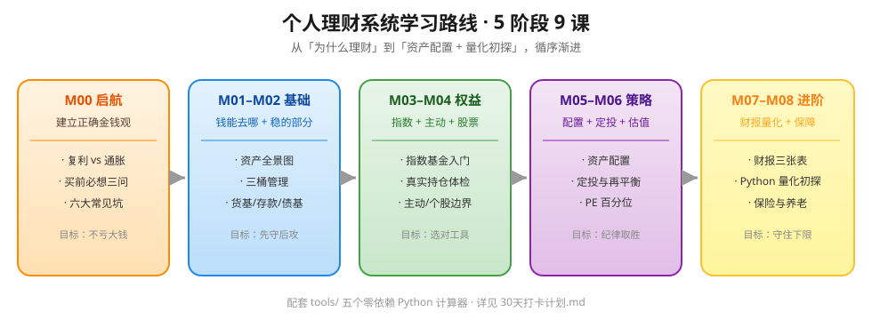

<p align="center">
  
</p>

<h1 align="center">📈 Personal Finance Learning Roadmap</h1>
<h3 align="center">A systematic, beginner-friendly, open-source personal-finance curriculum — from compounding vs. inflation to asset allocation & a taste of quant.</h3>

<p align="center">
  
  
  
  
  
</p>

<p align="center">
  <b>Built for people who want to <i>actually understand</i> money — not get rich quick.</b><br/>
  Looking for the Chinese version? → <a href="README.md">README（中文）</a>
</p>

---

## ✨ What is this?

Most personal-finance content online is polarized: either anxiety-marketing screaming "30% annual return!", or finance-engineering formulas thrown at you on day one. **This repo builds the missing middle path:**

> **Explain the core mental models of personal finance in plain language, and ship calculators you can run yourself.**

- 🧭 **Systematic** — 9 modules, sequenced: start → basics → equities → strategy → advanced
- 🧰 **Hands-on** — 5 zero-dependency Python tools in `tools/`, compute the concept on the spot
- 📖 **Framework-first** — no stock tips, no promised returns, just a "judgment framework"
- 🆓 **Free** — MIT licensed; fork, remix, teach others

> ⚠️ **Disclaimer**: This repository is for learning only and **is not investment advice**. All data is illustrative; past performance ≠ future results. Investing carries risk — decide independently.

<p align="center">
  <a href="https://github.com/WonderfulClaire/finance-learning-roadmap">
    
  </a>
  <br/>
  <span style="color:#666;font-size:13px">Share this QR card with anyone who wants to learn personal finance.</span>
</p>

---

## 🗺️ Roadmap


Five stages, nine modules. Learn in order, and check off each one in [`30天打卡计划.md`](30天打卡计划.md) (30-day plan).

---

## 📚 Curriculum

| # | Module | One-liner | Link |
|---|---|---|---|
| M00 | Start Here: Why & Pitfalls | compounding vs inflation, 3 questions before buying, 6 traps | [Web](lessons/00-启航-为什么理财与防坑.html) |
| M01 | Asset Map & Toolkit | where money goes, 5 asset classes, the 3-bucket method | [Web](lessons/01-资产地图与工具箱.html) |
| M02 | Cash & Fixed Income | how to pick money-market / deposits / bond funds | [Web](lessons/02-现金与固收.html) |
| M03 | Index Funds 101 | why beginners start with index funds + a real portfolio check-up | [Web](lessons/03-指数基金入门.html) |
| M04 | Active Funds & Stocks 101 | active vs index, what stocks actually pay you | [Web](lessons/04-主动基金与股票入门.html) |
| M05 | Asset Allocation & DCA | stocks+bonds mix, dollar-cost averaging, rebalancing | [Web](lessons/05-资产配置与定投.html) |
| M06 | Valuation & Timing | how to read PE / PB / percentiles | [Web](lessons/06-估值指标与择时.html) |
| M07 | Advanced: Financials & Quant | the 3 financial statements + Python metrics | [Web](lessons/07-进阶-财报与量化初探.html) |
| M08 | Insurance, Retirement & Tax | defend before attack, personal pension | [Web](lessons/08-保险与养老税务.html) |

Companion: 📘 [Glossary](https://github.com/WonderfulClaire/finance-learning-roadmap/blob/main/docs/glossary.md) · 📚 [Book list & resources](https://github.com/WonderfulClaire/finance-learning-roadmap/blob/main/docs/resources.md) · 🗓️ [30-day plan](30天打卡计划.md)

---

## 🚀 Quick Start

```bash
# 1. Clone
git clone https://github.com/WonderfulClaire/finance-learning-roadmap.git
cd finance-learning-roadmap

# 2. Start reading from M00
#    open lessons/00-启航-为什么理财与防坑.html
#    or open learn.html for the gamified progress page

# 3. Feel compounding with a tool (needs Python 3, zero deps)
python tools/compound_interest.py --principal 100000 --monthly 1000 --years 20 --rate 0.08
```

### 🌐 Live Calculator (GitHub Pages)

Prefer to play first? Open **`index.html`** — an interactive compounding & inflation calculator that runs entirely in your browser (no install). If GitHub Pages is enabled, it's live at:

```
https://wonderfulclaire.github.io/finance-learning-roadmap/
```

---

## 🧪 Examples (`examples/`, all reproducible)

Theory with real numbers. Every example calls the `tools/` scripts directly and includes the actual output:

| Example | What it covers | Tool(s) |
|---|---|---|
| [01 基金体检](examples/01-基金体检实战.md) | Compare two real funds on fees, return, and valuation | `fund_compare.py` |
| [02 复利滚雪球](examples/02-复利滚雪球实战.md) | ¥100k + ¥1k/month for 20 years: compounding and inflation | `compound_interest.py` + `inflation_impact.py` |
| [03 资产配置](examples/03-资产配置实战.md) | Target allocation by age/risk + valuation percentile | `asset_allocation.py` + `pe_percentile.py` |

→ See [`examples/README.md`](examples/README.md) and the [`sample-portfolio.csv`](examples/data/sample-portfolio.csv) exercise dataset.

---

## 🎮 Gamified Learning: Progress · Milestones · Certificate

Open **[`learn.html`](learn.html)** and learn like a game:

- ✅ **Progress tracking** — tick off any of the 9 modules; progress is saved in your browser (localStorage), no server
- ⭐ **XP / Levels** — each module completed = +100 XP, level rises with experience
- 🏅 **Stage milestones** — finishing a stage lights up a badge (Starter → Asset Steward → Equity Investor → Strategy Master → Finance Master), with a confetti celebration
- 🏆 **Custom certificate** — after all 9 modules, fill in your name & date and generate a certificate on Canvas — **download as PNG or print / save as PDF** to share

---

## 🧰 Toolbox (`tools/`, all zero-dependency)

| Tool | What it does | Example |
|---|---|---|
| `compound_interest.py` | compound & DCA future value + Rule of 72 | `--principal 100000 --monthly 1000 --years 20 --rate 0.08` |
| `inflation_impact.py` | inflation erodes purchasing power | `--amount 100000 --years 30 --inflation 0.03` |
| `asset_allocation.py` | stock/bond/cash split by age & risk | `--age 28 --risk 高 --amount 100000` |
| `pe_percentile.py` | current PE percentile in history | `--current 15 --history 12,13,14,15,18,20,22` |
| `fund_compare.py` | compare two funds (fee / return) | see `--help` |

---

## 🗓️ 30-Day Plan

Don't hoard courses. Follow [`30天打卡计划.md`](30天打卡计划.md) — one theme a day, review on weekends. Goal: a **"learn → act → review"** loop, not a bookmark graveyard.

---

## 🤝 Contributing

PRs and Issues welcome — corrections, cases, tools, translations. **Finance content has low error tolerance; fixing mistakes is the most valuable contribution.** See [CONTRIBUTING.md](CONTRIBUTING.md). Red lines:

- ❌ No "buy X now" advice, no promised returns, no referral/account-opening links
- ✅ Everything serves "help readers build the right mental model"

---

## 📜 License

[MIT](LICENSE) — use freely, just keep the attribution.

---

## ⭐ If this helped you

A **Star** ⭐ is the biggest support for "making finance education accessible to all", and helps more people avoid common traps. Share it with that friend who wants to start but doesn't know where 🙌

> Personal finance is cognition made tangible. Slow is fast. May you improve steadily, without panic.
