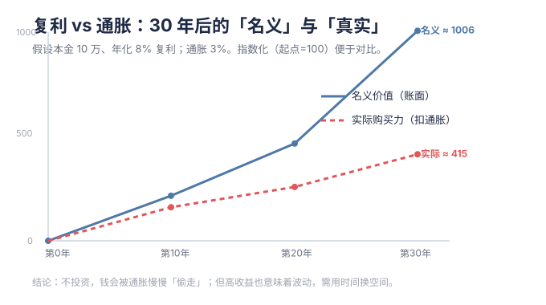

# M00 · 启航：为什么理财，以及如何不踩坑

> 这一节不教你买什么，先把脑子里的坑填平。读完大概 40 分钟，最后有一张本周就能照着做的清单。

---

## 一、先说点不好听的：理财不是“暴富”

我猜你冲进理财，心里想的是“钱生钱、早点不上班”。这想法太正常了，但也是最容易被割的起点。

几个大概率会发生的事：

- 你的第一目标不该是“赚最多”，而是**别一把亏光，同时别让钱被通胀慢慢吃掉**。这两件事做到，你就已经跑赢大多数乱操作的人。
- 复利真正起作用，靠的是**时间长 + 别中断**，不是某一次押对。一次翻倍，不如二十年不间断。
- 市场最擅长教训“我觉得我很聪明”的人。加杠杆、听内幕、追短线暴富故事——你看到的那些赢家，大多是幸存者偏差，输家根本不会出来讲。

顺带一句：你之前跟着朋友买的那两只基金，问题不在基金本身，而在于“没研究就买”。后面 M03 我会拉真实数据帮你复盘，看看到底适不适合长期拿。

---

## 二、两把剪刀：复利 vs 通胀

为什么要理财？把这两件事放一起就懂了。

### 1) 复利：时间真的能换钱

拿 10 万本金、年化 8% 举例：

- 10 年后 ≈ 21.6 万
- 20 年后 ≈ 46.6 万
- 30 年后 ≈ 100.6 万

注意看曲线：越往后越陡。所以“早点开始”比“一次投很多”重要得多。仓库里有个小工具，把你自己的金额填进去就能看到属于你的曲线：

```bash
python tools/compound_interest.py --principal 100000 --years 30 --rate 0.08
```

### 2) 通胀：那个不动声色偷你钱的东西

假设每年通胀 3%，今天的 100 块，30 年后购买力只剩约 41 块。钱放活期，不是“没动”，是每年都在悄悄变少。

所以理财的本质其实挺朴素：让“钱生钱”的速度，稳稳超过“钱贬值”的速度。跑平通胀大概要 3%–4% 年化；想真正增值，通常奔着 6%–10% 去，但波动也会更大——这就是后面要一点点学的取舍。

### 3) 72 法则：不用计算器也能估

本金翻一倍要多少年？≈ **72 ÷ 年化收益率(%)**

- 8% → 约 9 年翻倍
- 12% → 约 6 年翻倍
- 通胀 3% → 约 24 年购买力腰斩



---

## 三、买任何东西前，先问自己三句话

这是全教程最值钱的三问，建议直接贴在屏幕上：

1. **这笔钱我多久不用？** —— 明年就要用的钱，别扔进波动大的地方。
2. **亏多少我会睡不着？** —— 这是你的风险底线，不是“我想赚多少”。
3. **我为什么买、什么时候卖？** —— 答不上“怎么卖”，就等于没计划，只能被情绪牵着走。

（相关概念卡：[[资产配置]]、[[风险承受能力与风险偏好]]、[[通胀]]、[[复利]]）

---

## 四、三条保命原则

1. **先保命，再赚钱**：应急金（3–6 个月生活费）和必要的保险没备好之前，别碰高波动投资。
2. **不懂不投**：别人说“长期持有稳赚”你就跟，是最大的坑。你不知道他成本多少、什么时候跑路。
3. **分散 + 守纪律**：再看好的东西也别 all in；用定投和再平衡，代替“我觉得该买了”的冲动。

---

## 五、新手最爱踩的 6 个坑

| 坑 | 真相 |
|---|---|
| 跟着朋友/大V 买，自己没研究 | 他亏得起你未必；他卖了你根本不知道 |
| 把基金当股票天天炒 | 基金费率高、波动慢，不适合日内折腾 |
| 只看收益不看回撤 | 一年涨 50% 可能先跌 40%，你多半拿不住 |
| 借钱 / 加杠杆炒股 | 波动会被放大到强制平仓，直接归零 |
| 信“保本高收益” | 收益和风险永远绑定，反常的八成是骗局 |
| 追涨杀跌 | 高点冲进去、低点割肉，完美反向操作 |

---

## 六、本周就能做的事 ✅

- [ ] 用工具算一次你自己的复利曲线（填真实能投的金额）
- [ ] 盘一下：活期 + 货基够不够 **3–6 个月支出**？不够先补
- [ ] 写下一个数：账户浮亏 **___%** 你会睡不着？（这就是你的风险红线）
- [ ] 把你已经买的产品，用上面“三问”过一遍，记下来

---

## 七、接下来去哪

→ **M01 资产地图与工具箱**：钱到底能去哪些地方，各自的收益、风险、取用方便程度都长啥样。

